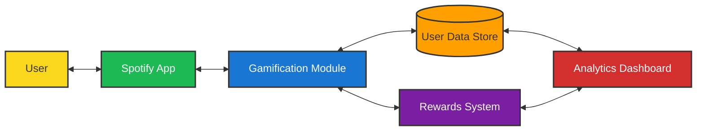

# Spotify Retention Gamification Mockup

## Project Overview

This project aims to increase user retention for Spotify by implementing a gamification solution. The idea is to engage users through rewards, challenges, and interactive features to make their experience more enjoyable and encourage long-term usage. This website is a mockup design for my project idea, created using the Loveable AI bot.

**Project Deck Link** : [NL Spotify](https://assets.nextleap.app/submissions/NLSpotify-fc3d6a34-3c70-4611-b42b-b60cef6d2e45.pdf)

**URL**: [Open in mobile view for better experience](https://preview--engage-beat-friends.lovable.app/)

## Data Flow Diagram 


## Getting Started

**Prerequisites**
- Node.js (v16 or higher)
- npm (v8 or higher) or yarn
- A modern web browser (e.g., Chrome, Firefox)

**Installation**

```sh
# Step 1: Clone the repository using the project's Git URL.
git clone <YOUR_GIT_URL>

# Step 2: Navigate to the project directory.
cd <YOUR_PROJECT_NAME>

# Step 3: Install the necessary dependencies.
npm i

# Step 4: Start the development server with auto-reloading and an instant preview.
npm run dev
```

**Running the Project Locally**
```sh
**# Start the development server
npm start (or yarn start)

# Open your browser and visit:
http://localhost:3000

# You should see the mockup website running.**
```

## Tech Stack

This project is built with .

- Frontend: HTML, CSS, JavaScript (generated via Loveable AI bot)
- Framework: React.js with TypeScript
- UI Components: shadcn-ui
- Styling: Tailwind CSS
- Build Tool: Vite

## Additional Notes
This is a mockup, so functionality is limited to the design prototype. Full implementation would require backend integration and Spotify API connections. To enhance this project, consider adding real API calls to Spotify's developer platform.


## Developers
- [Ritik Mittal](https://github.com/Ritik1221)
- [Loveable](https://lovable.dev/)
